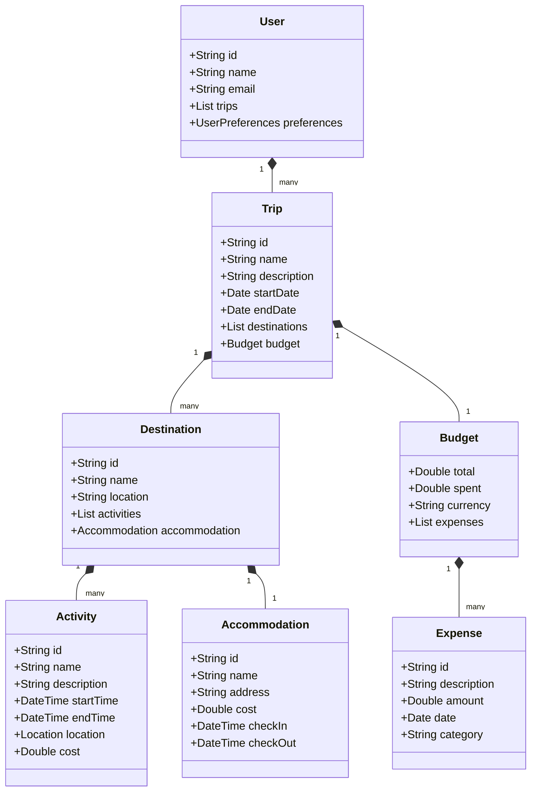

# Diseño de Travel Planner

## Arquitectura

La aplicación sigue el patrón de arquitectura MVVM (Model-View-ViewModel) junto con Clean Architecture para mantener un código limpio y mantenible.

### Capas de la Aplicación

1. **Presentación (UI)**
   - Activities/Fragments
   - Composables
   - ViewModels
   - Estados UI

2. **Dominio**
   - Casos de Uso
   - Modelos de Dominio
   - Interfaces de Repositorio

3. **Datos**
   - Implementaciones de Repositorio
   - Fuentes de Datos
   - Modelos de Datos

## Modelo de Datos



## Tecnologías Principales

1. **UI/UX**
   - Jetpack Compose
   - Material Design 3
   - Navigation Component

2. **Persistencia de Datos**
   - Room Database
   - DataStore Preferences

3. **Inyección de Dependencias**
   - Dagger Hilt

4. **Concurrencia**
   - Coroutines
   - Flow

5. **Networking**
   - Retrofit
   - OkHttp

## Patrones de Diseño

1. Repository Pattern
2. Factory Pattern
3. Observer Pattern (Flow)
4. Dependency Injection
5. Builder Pattern

## Estrategia de Testing

1. **Unit Tests**
   - ViewModels
   - Use Cases
   - Repositories

2. **Integration Tests**
   - Database
   - API

3. **UI Tests**
   - Compose UI Testing
   - End-to-End Tests

# Diseño de la Base de Datos

## Esquema de la Base de Datos

La aplicación utiliza Room como capa de abstracción sobre SQLite para el almacenamiento persistente de datos. El esquema de la base de datos está compuesto por tres tablas principales:

### Tabla: trips
- **id** (String, Primary Key): Identificador único del viaje
- **name** (String): Nombre del viaje
- **destination** (String): Destino del viaje
- **startDate** (LocalDate): Fecha de inicio del viaje
- **endDate** (LocalDate): Fecha de fin del viaje
- **createdAt** (LocalDate): Fecha de creación del viaje

### Tabla: days
- **id** (String, Primary Key): Identificador único del día
- **tripId** (String, Foreign Key): Referencia al viaje al que pertenece el día
- **date** (LocalDate): Fecha del día
- **dayNumber** (Integer): Número de día en el viaje

### Tabla: activities
- **id** (String, Primary Key): Identificador único de la actividad
- **dayId** (String, Foreign Key): Referencia al día al que pertenece la actividad
- **name** (String): Nombre de la actividad
- **description** (String): Descripción de la actividad
- **startTime** (LocalTime): Hora de inicio de la actividad
- **endTime** (LocalTime, Nullable): Hora de fin de la actividad (opcional)
- **location** (String): Ubicación de la actividad

## Relaciones

- Un viaje (Trip) puede tener múltiples días (Days) - Relación 1:N
- Un día (Day) puede tener múltiples actividades (Activities) - Relación 1:N
- Las relaciones están implementadas usando claves foráneas con eliminación en cascada

## Conversores de Tipos

Se han implementado conversores personalizados para manejar los tipos de datos LocalDate y LocalTime:
- LocalDate se almacena como Long (días desde la época)
- LocalTime se almacena como String (formato ISO-8601)

## Estrategia de Migración

Actualmente, la base de datos está en su versión 1. Para futuras actualizaciones del esquema:

1. Incrementar el número de versión en la anotación @Database
2. Crear una clase de migración que extienda Migration
3. Implementar la lógica de migración en el método migrate()
4. Registrar la migración en el DatabaseModule

Ejemplo de migración futura:

```kotlin
val MIGRATION_1_2 = object : Migration(1, 2) {
    override fun migrate(database: SupportSQLiteDatabase) {
        // Lógica de migración
    }
}
```

## Validación de Datos

- Los IDs son generados usando UUID para garantizar unicidad
- Las fechas de fin deben ser posteriores a las fechas de inicio
- Los nombres de viajes no pueden estar vacíos
- Las actividades deben tener un nombre y una ubicación
- Las horas de fin son opcionales pero deben ser posteriores a las horas de inicio si se especifican

## Manejo de Errores

- Uso de transacciones para operaciones que afectan a múltiples tablas
- Validación de datos antes de la inserción
- Manejo de errores de base de datos en el repositorio
- Logging de operaciones de base de datos para depuración 